

# Practicando Git

***Nombre: Atteneri***
***Curso: 1ºDAM*** 

### ÍNDICE

+ [Introducción](#id1)
+ [Objetivos](#id2)
+ [Material empleado](#id3)
+ [Desarrollo](#id4)
+ [Conclusiones](#id5)

#### ***Introducción***. 

En esta práctica utilizamos varios comandos para crear un repositorio nuevo y editarlo haciendo commits, añadiendo ficheros, creando tags y creando ramas.

#### ***Objetivos***. 

Con esta práctica se busca practicar los diferentes comandos de git.

#### ***Material empleado***. 

En esta practica no se ha utilizado ningún hardware o software en específico ni tampoco ninguna configuración de red. 

#### ***Desarrollo***. 

Primero creamos el README

`touch README.md`

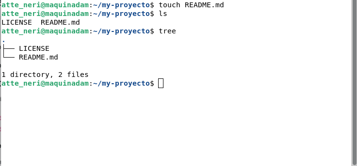

Hacemos un commit con el mensaje "commit inicial"

`git add .`

`git commit -m "commit inicial"`

Y subimos los cambios al repositorio remoto

`git push origin master`

Sin embargo, podemos omitir el "origin master" y simplemente usar `git push` 

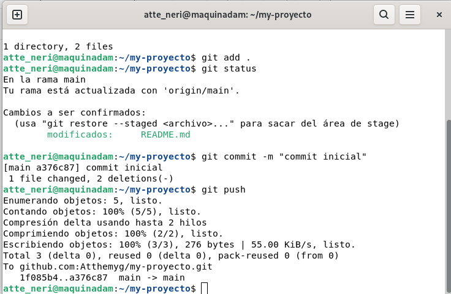

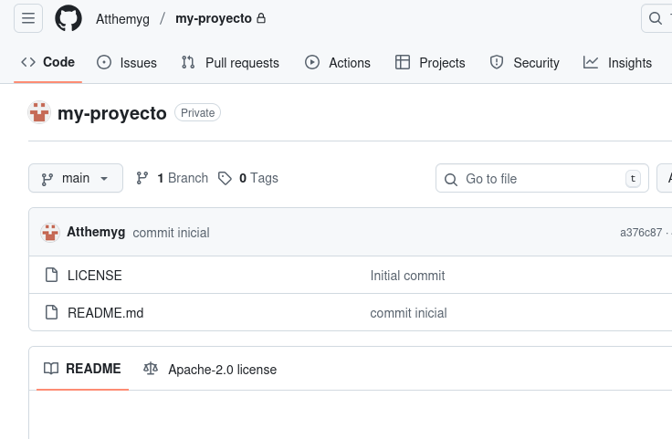

A continuación creamos en el repositorio local un fichero (privado.txt) y una carpeta (privada) que serán ignorados por git

`touch privado.txt`

`mkdir privada`

`echo "privado.txt" >> .gitignore`

`echo "/privada" >> .gitignore`

`git add .`

`git commit -m "añadido fichero .gitignore"`

Si empleamos estos comandos correctamente ni el fichero ni la carpeta no deberían de subir al repositorio ya que el fichero `.gitignore` le indica a Git que archivos o carpetas debe de ignorar y no incluir en futuros commits.

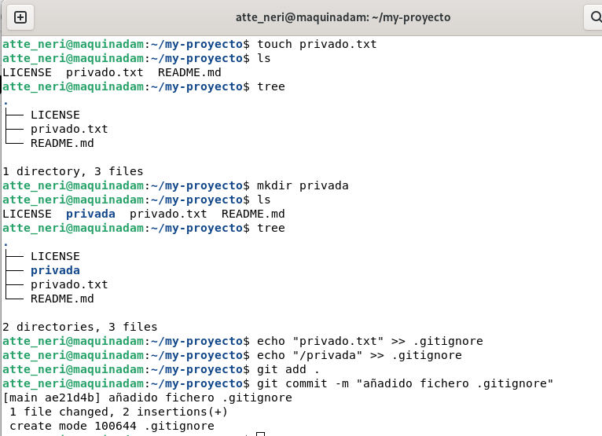

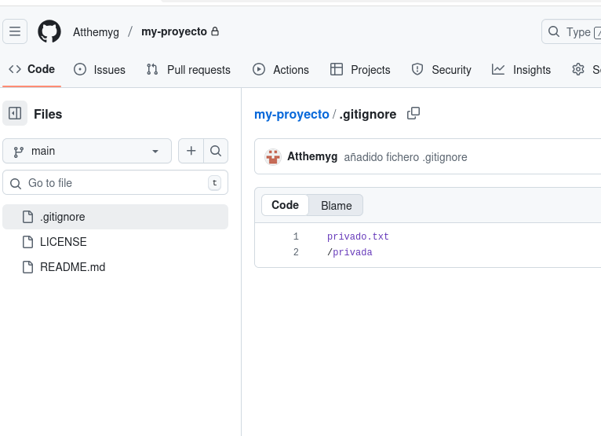

Ahora añadiremos un fichero (1.txt) al repositorio local

`touch 1.txt`

`git add .`

`git commit -m "añadido 1.txt"`

El comando `git add .` prepara los archivos para ser incluidos en el proximo commit

El comando `git commit` registra de forma permanente los cambios preparados en el historial del repositorio local

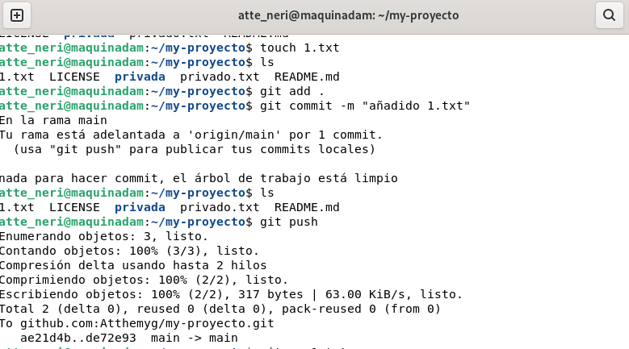

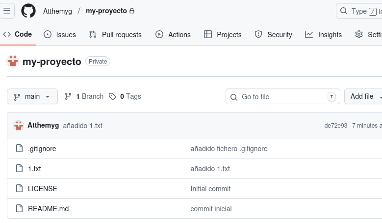

Crearemos un tag (tag v0.1)

`git tag v0.1`

Y subiremos los cambios al repositorio remoto

`git push --tag origin master`

El tag es una especie de etiqueta que en Git se emplea para identificar un punto concreto en la historia del repositorio para señalar, entre otras cosas, versiones importantes.

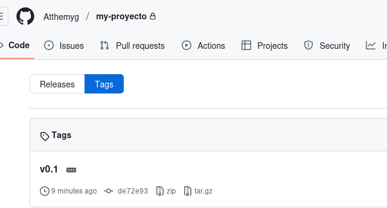

Podemos crear una rama (v0.2)

`git branch v0.2`

Y posicionaremos nuestra carpeta de trabajo en ella

`git checkout v0.2`

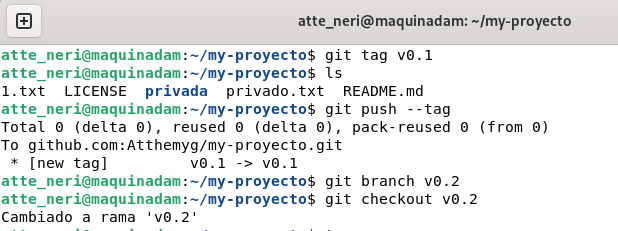

Añadimos un fichero (2.txt) en esta rama

`touch 2.txt`

`git add .`

`git commit -m "añadido 2.txt"`

Las ramas en Git permiten trabajar en paralelo sin afectar la versión principal del proyecto y así desarrollar nuevas funcionalidades, corregir errores o probar cambios de forma aislada y controlada

Y subimos los cambios al repositorio remoto

`git push origin v0.2`

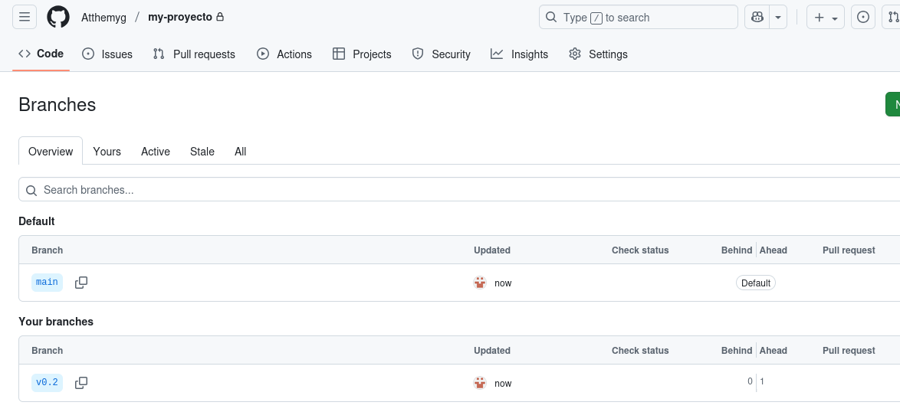

Ahora nos posicionaremos en una rama main/master (dependiendo de cual sea tu rama principal)

`git checkout main`

Y hacemos un merge de la rama v0.2 en la rama main

`git merge v0.2 -m "merge v0.2 sin conflictos"`

Aquí no se tendrían que provocar conflictos ya que ninguna de las dos ramas han modificado la misma línea de un archivo ni se han realizado cambios incompatibles en un mismo elemento del proyecto

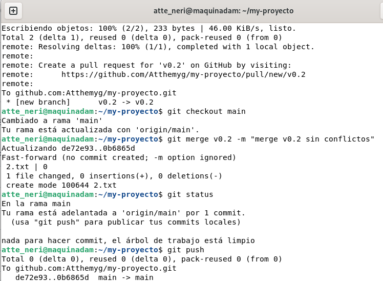

Sin embargo, si en la rama main ponemos un "Hola" en el fichero 1.txt y hacemos un commit

`git checkout main`

`echo "Hola" >> 1.txt`

`git add .`

`git commit -m "hola en 1.txt"`

Y nos posicionamos en en la rama v0.2 y ponemos "Adiós" en el fichero 1.txt y hacemos un commit

`git checkout v0.2`

`echo "Adios" >> 1.txt`

`git add .`

`git commit -m "adios en 1.txt"`

Nos da un error

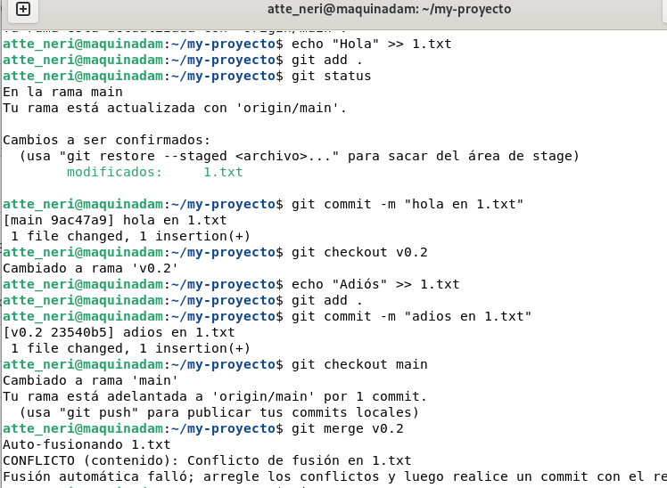

Nos posicionamos de nuevo en la rama main y hacemos un merge con la rama v0.2

`git checkout master`

`git merge v0.2`

`vim 1.txt`

`git add .`

`git commit -m "arreglado merge en 1.txt"`

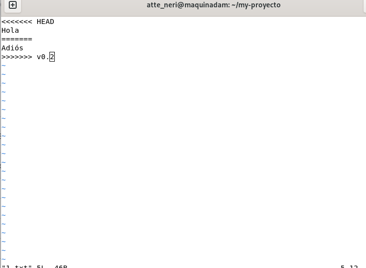
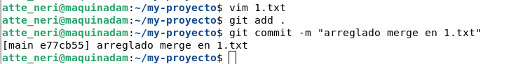

Listaremos las ramas con merge y sin merge

`git branch --merged`

`git branch --no-merged`

Y arreglamos el conflicto antes de hacer un commit

`nano 1.txt`

`git add .`

`git commit -m "arreglado merge en 1.txt"`

Podemos borrar la rama. Creamos un tag (v0.2)

`git tag v0.2`

Y la eliminamos

`git branch -d v0.2`

Por último listamos los distintos commits con sus ramas y sus tags

`git config --global alias.list 'log --oneline --decorate --graph --all'`

`git list`

#### ***Conclusiones***. 

Esta practica nos ayuda a poner en práctica los diferentes comandos de git y aprender para que sirve cada uno 
