

# ECLIPSE

***Nombre:Atteneri, Jaime, Borja, Peter y Adrián***
***Curso:1ªDAM***

### ÍNDICE

+ [Introducción](#id1)
+ [Objetivos](#id2)
+ [Material empleado](#id3)
+ [Desarrollo](#id4)
+ [Conclusiones](#id5)

#### ***Introducción***. 

+ Eclipse es una plataforma de software compuesto por un conjunto de herramientas de
programación de código abierto multiplataforma para desarrollar lo que el proyecto llama
"Aplicaciones de Cliente Enriquecido", opuesto a las aplicaciones "Cliente-liviano" basadas en
navegadores. Eclipse es también una comunidad de usuarios, extendiendo constantemente las áreas de
aplicación cubiertas.

+ Fue lanzada el 7 de noviembre de 2001 por Object Technology International(IBM) aunque ahora es desarrollado por la Fundación Eclipse.

+ Este se  creó principalmente orientado para Java, aunque también puede soportar C, C++, PHP, Phyton o Ruby.

+ Evolución a lo largo del tiempo:

2001: Eclipse 1.0 => Lanzamiento inicial del IDE. Se centró en el desarrollo de Java.

2004: Eclipse 3.0 => Introducción de la arquitectura de plugins y el modelo de extensibilidad, permitiendo a los desarrolladores crear plugins personalizados.

2006: Eclipse 3.6 => Mejoras en la gestión de proyectos, integración de herramientas de desarrollo e introducción del IDE para el desarrollo de C/C++.

2008: Eclipse 3.4 => Fue el primer lanzamiento que incluía múltiples proyectos de software, incluyendo EclEmma y JSDT.

2011: Eclipse 3.7 => Enfoque en la mejora del desarrollo de aplicaciones en la nube e integración con la plataforma de desarrollo de Java EE.

2013: Eclipse 4.3 => Se centró en el desarrollo de aplicaciones con mejoras en la interfaz de usuario y un mejor rendimiento en plugins.

2015: Eclipse 4.5 => Mejoras significativas en Java 8, integración con Git y un nuevo formato de instalación.

2018: Eclipse 4.7 => Se centró en la mejora de la experiencia del desarrollador y el soporte para nuevas herramientas de desarrollo como Docker.

2020: Eclipse 4.16 => Introducción de soporte para nuevas versiones de Java y mejoras en la gestión de dependencias.

2023: Eclipse 4.27 => Enfocada en la estabilidad, rendimiento y soporte a tecnologías emergentes, incluyendo mejoras en el soporte para el desarrollo móvil.

#### ***Objetivos***. 

Con esta práctica pretendemos alcanzar los siguientes objetivos:

+ Aprender sobre nuevos entornos de desarrollo integrados.

+ Enseñarle a los demás compañeros sobre el entorno Eclipse.

+ Lograr los conocimientos básicos para aprobar la asignatura.

#### ***Material empleado***. 

+ Ordenador

+ Una máquina virtual

+ IDE (Eclipse)

+ Una presentación en Canva
 

#### ***Desarrollo***. 

Para realizar esta práctica utilizamos los apuntes facilitados de la asignatura e información de otras páginas web
para completar nuestra presentación.

A continuación mostramos los pasos que hemos seguido para instalar Eclipse y explicar las diferentes funciones que este IDE incluye.

**1. Instalación**

Una vez descargado Eclipse, hacemos doble clic sobre el paquete y se nos abrirá una ventana donde prepara todo lo necesario para su correcta instalación.

A continuacion se nos abrira un asistente diferente empaquetado que incorporar
funcionalidades según el lenguae a desarrollar, nosotros hemos elegido la primera opcion.

Luego elegiremos la carpeta de ubicación de nuestro IDE, y marcaremos la opcion de
que nos cree el acceso directo en el escritorio.

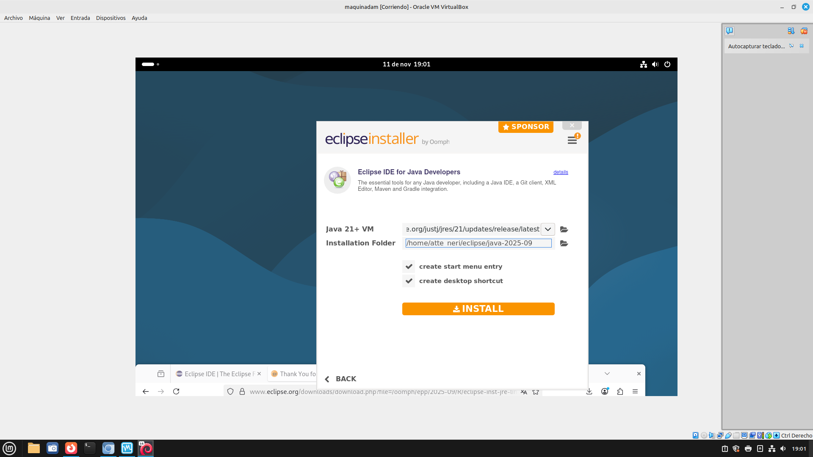

Posteriormente aceptaremos los términos de uso si estamos de acuerdo.

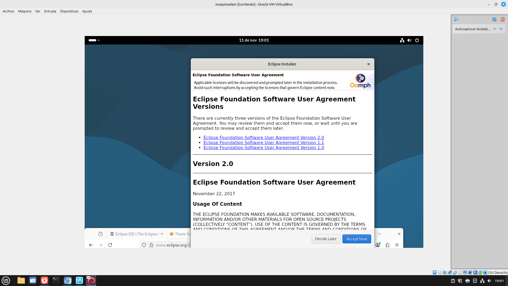

Y comenzaremos con la instalación de nuestro entorno.

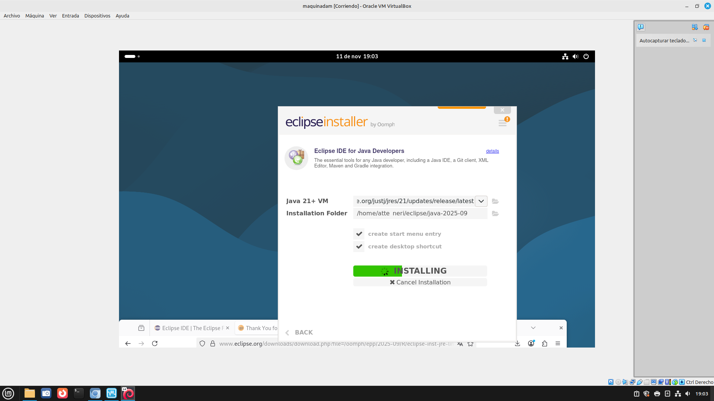

Una vez instalados lo inicializamos.

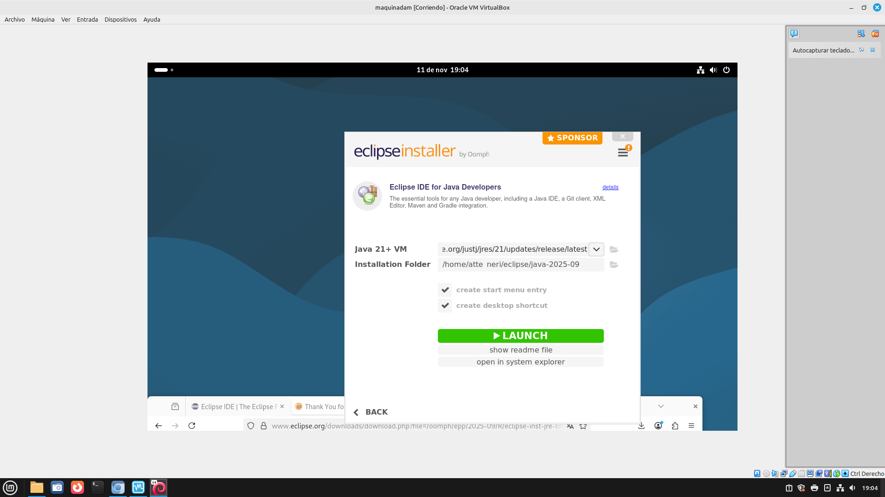

Antes de abrirse nos pedira que le indiquemos donde guardar los proyectos que realicemos.

Ya tenemos nuestro entorno de desarrollo.

**2. Crear proyecto**

Ahora vamos a crear un nuevo proyecto para ver algunas de sus herramientas.
Para iniciar un nuevo proyecto iremos a la pestaña File => New => Java Project.

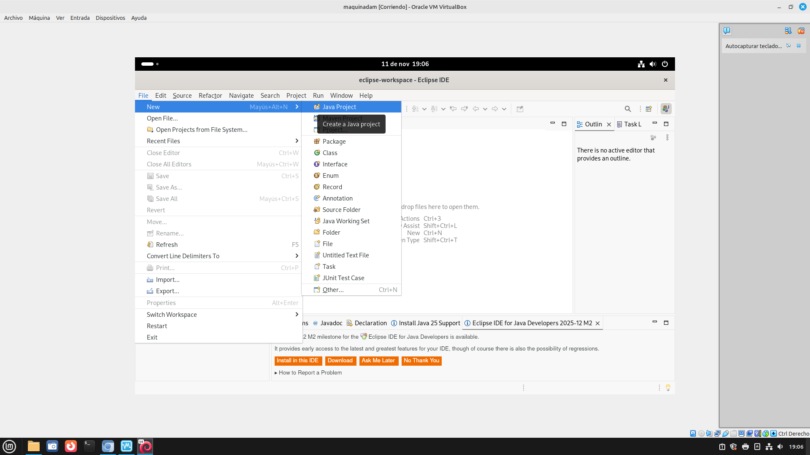

Se nos abrirá la siguiente ventana en la que debemos indicar el nombre del proyecto y
modificar la ubicación de este si lo deseamos.

Una vez creado el proyecto, nos aparecerá la pantalla principal del proyecto.

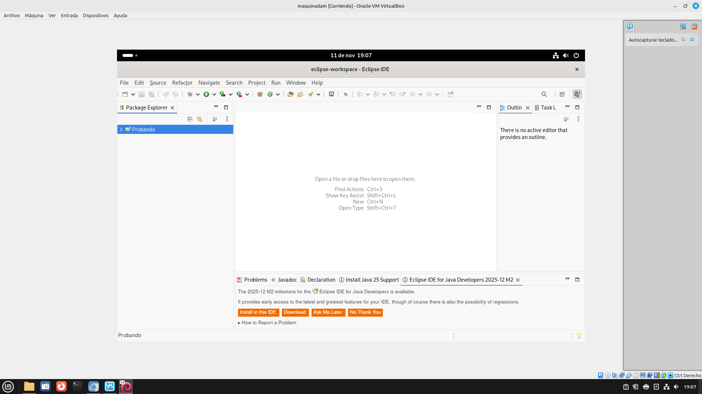

Para poder comenzar a escribir nuestro programa lo primero que debemos hacer es crear la
clase principal de nuestro algoritmo. Para ello, simplemente hacemos clic en el icono "verde C"
y se nos abrirá una ventana donde debemos indicar el nombre de la clase y marcar
la casilla que creará el método.

**3. Editor de texto**

Ya tenemos aquí nuestro editor de texto con la clase main ya construida.

A continuación, debemos escribir nuestro programa. Podemos distinguir que nos muestra de forma resaltada las palabras reservadas del lenguaje.

El editor de texto nos ayuda según vamos escribiendo, e irá marcando con un subrayado rojo los posibles errores de sintaxis y posibles errores léxicos.

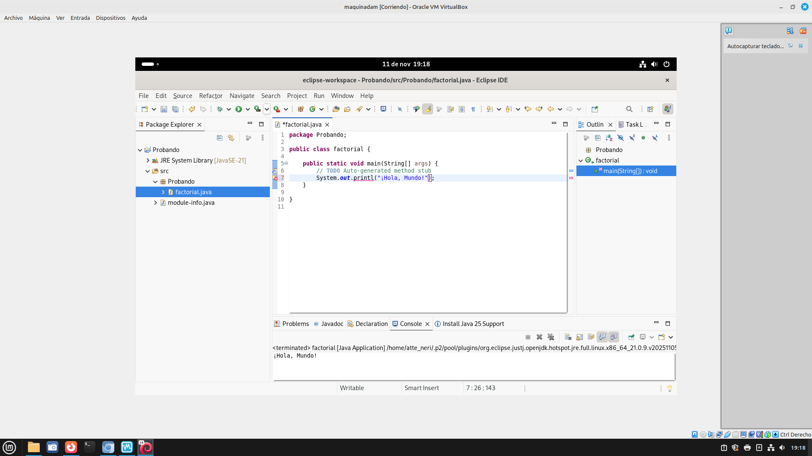

El error descrito anteriormente es difícil de cometer puesto que como podemos ver en la imagen inferior, el propio editor nos muestra las posibles opciones disponibles según vamos escribiendo.

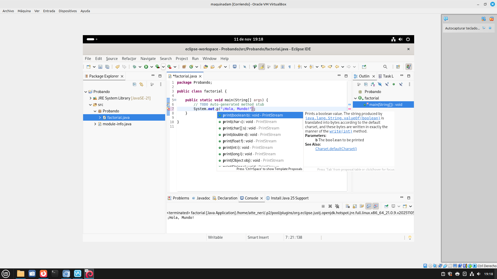

**4. Compilador**

Para ejecutar el programa debemos compilar nuestro código, es decir, transformar nuestro
código fuente en un código binario o código máquina y para ello, tenemos varias formas de
hacerlo, a través del botón "verde de reproducir" o desde la pestaña ejecutar o con Ctrl+F11.

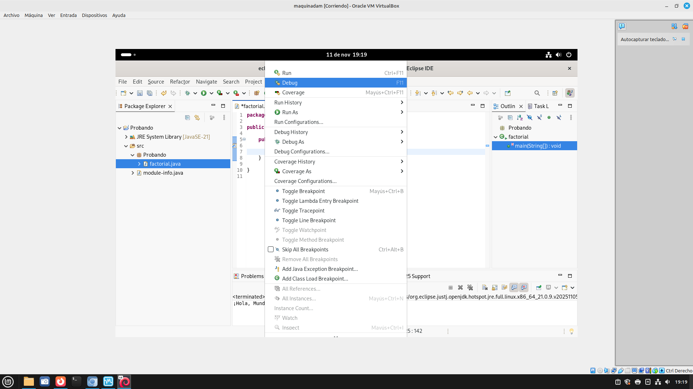

En el caso de eclipse solo hay una forma de compilar y es que cuando hacemos clic en ejecutar
para observar el resultado del código, este mismo por debajo está creando el archivo .java.

**5. Depurador**

El depurador o debugger nos permite ejecutar el código fuente paso a paso para identificar
posibles errores de forma más sencilla y rápida facilitándonos su búsqueda y obtener una
forma más eficiente de desarrollo.
Para ello, nos permite utilizar puntos de ruptura o breakpoint, para detener la ejecución del
programa y poder observar el estado de las variables, su valor e incluso modificarlo sobre la
marcha y continuar la ejecución.

Hay varias formas de iniciar la ejecución del programa en modo depuración:

Podemos hacerlo mediante la pestaña Ejecutar => Depurar, o con un atajo de teclado (F11) o pulsando sobre el botón de "escarabajo"

Para el uso del depurador manejamos distintas opciones a través de botones:

+ Step Over (F6): Ejecuta una línea de código.
+ Step Into (F5): Ejecuta una línea de código. Si la instrucción es una llamada a un método, salta
al método y continúa la ejecución por la primera línea del método.
+ Reanudar (F8): La ejecución del programa continúa hasta el siguiente punto de ruptura. Si no
existe un punto de ruptura se ejecuta hasta el final.
+ Detener (Ctrl + F2): Termina la depuración del programa.

**6. Establecer puntos de ruptura**

Un punto de ruptura es una marca que indica al depurador que debe detenerse cuando la ejecución del programa llegue a ella.
Cuando el programa se detiene podemos:

Examinar los valores actuales de las variables o continuar la depuración línea a línea del programa.

Para fijar un punto de ruptura simplemente pulsamos sobre la parte izquierda del número de
línea donde se desea colocar.

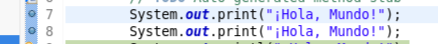

**7. Plugins**

Eclipse nos ofrece una serie de plugins con los que podremos trabajar. Para descargar e instalar cualquier plugin en el entorno de eclipse tenemos que ir a Ayuda => eclipseMarketplace. Podríamos decir que es como una tienda de plugins, tan solo debemos buscar el plugin que queramos y hacer clic en instalar.

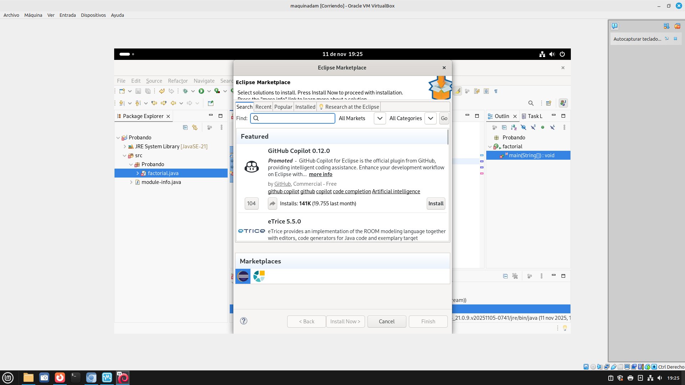

Cuando hagamos clic en aceptar nos aparecerá una nueva ventana en la cual tenemos que aceptar los términos de licencia.

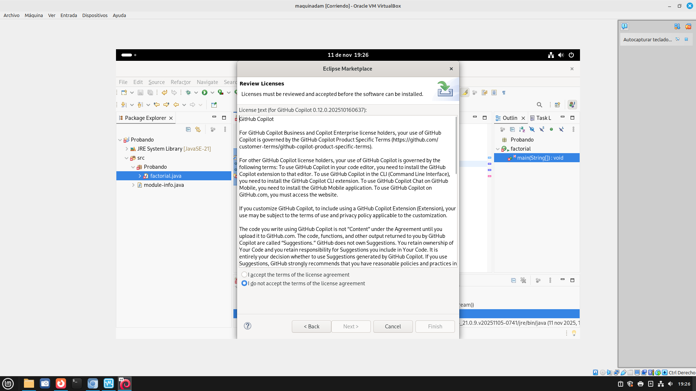

Y comenzará la instalación de nuestro plugin.

Por último, solo nos queda reiniciar el IDE para aplicar los cambios.

**8. Control de versiones**

Eclipse dispone de una herramienta muy útil para los desarrolladores de software, es el control
de versiones. Esta herramienta nos muestra los cambios sufridos en nuestro código fuente a lo
largo de su codificación.

Para acceder a dicha herramienta simplemente pulsamos clic derecho sobre el paquete que
queremos ver y hacemos clic en la opción "comparar". Nos aparecerán las distintas versiones
que han sido guardadas a lo largo del desarrollo, ahora solo tenemos que seleccionar la
versión que queremos mostrar.

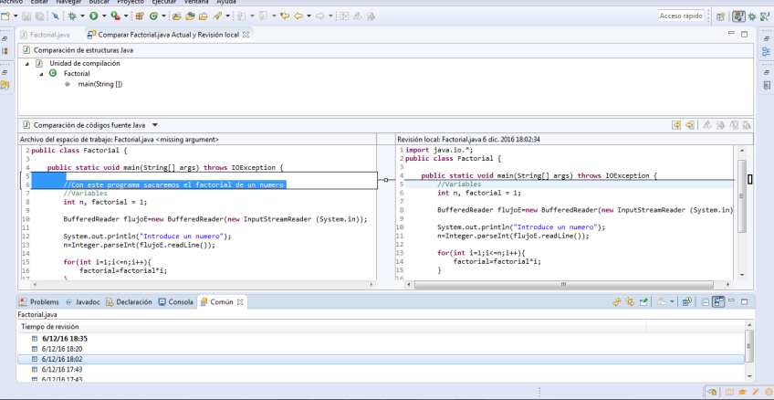

Como podemos observar en la imagen, al seleccionar una de las versiones nos destaca visualmente cuales han sido los cambios entre la versión seleccionada y la última disponible.

**9. Panel de configuración**

Para acceder a la configuración de Eclipse debemos ir a la pestaña Ventanas => preferencias.

El panel de opciones está dividido en dos partes: un panel de navegación a la izquierda y un
área de presentación a la derecha. El panel de navegación está formado por un árbol de
directorios, como General, Validación, Equipo, Ayuda... Para acceder a las opciones de cada
carpeta debemos expandir cualquier la carpeta deseada para ver las páginas de opciones que
contiene. Cuando selecciona una de las carpetas de una página determinada, sus opciones
aparecen en el área de presentación.

Al hacer clic en Aplicar en el cuadro de diálogo se guardan todas las configuraciones de todas
las páginas y tan solo nos queda hacer clic en aceptar para salir.

**10. Refactorización**

La refactorización es la parte del mantenimiento del código que no arregla errores ni añade
funcionalidad. El objetivo, por el contrario, es mejorar la facilidad de comprensión del código o
cambiar su estructura y diseño y eliminar código muerto, para facilitar el mantenimiento en el
futuro. Añadir nuevo comportamiento a un programa puede ser difícil con la estructura dada
del programa, así que un desarrollador puede refactorizarlo primero para facilitar esta tarea y
luego añadir el nuevo comportamiento.

En esta pestaña disponemos de opciones como cambiar el nombre del paquete principal,
mover, copiar y eliminar código, seleccionando una parte de código lo podemos reestructurar
creando métodos, etc.

#### ***Conclusiones***. 

Tras la realización de esta práctica hemos podido comprender de forma completa el funcionamiento del entorno de desarrollo Eclipse, así como la importancia que tiene en el ámbito de la programación. A través del proceso de instalación, creación de proyectos y exploración de sus distintas herramientas, hemos comprobado que Eclipse es un IDE muy completo, flexible y adecuado tanto para principiantes como para desarrolladores más avanzados.

En definitiva, esta práctica no solo nos ha enseñado a utilizar Eclipse, sino que también nos ha ayudado a comprender mejor el proceso completo de creación, análisis y mantenimiento de programas en un entorno real de desarrollo, cumpliendo así los objetivos planteados al inicio.

